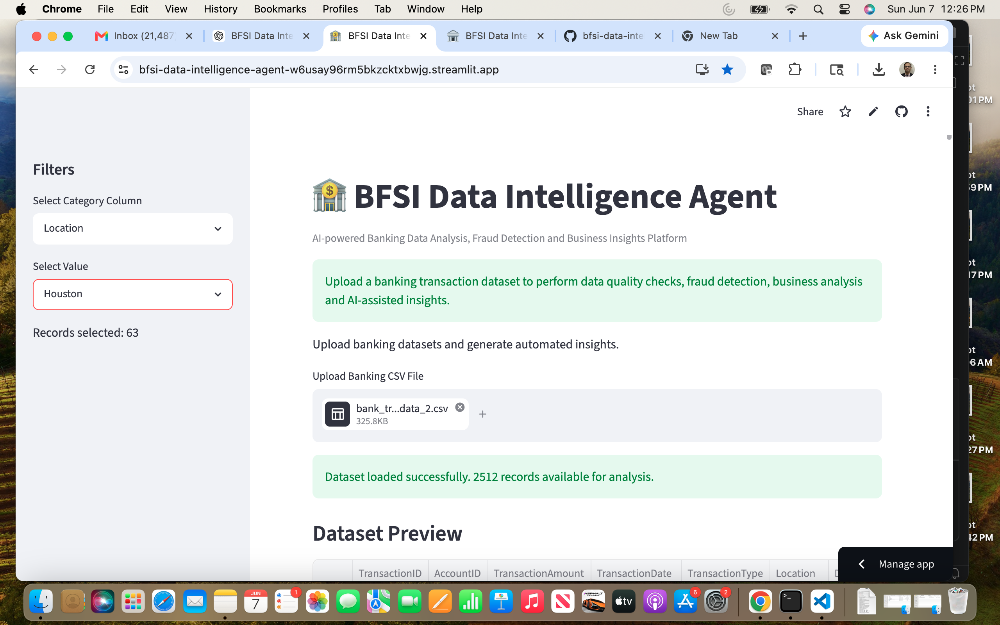
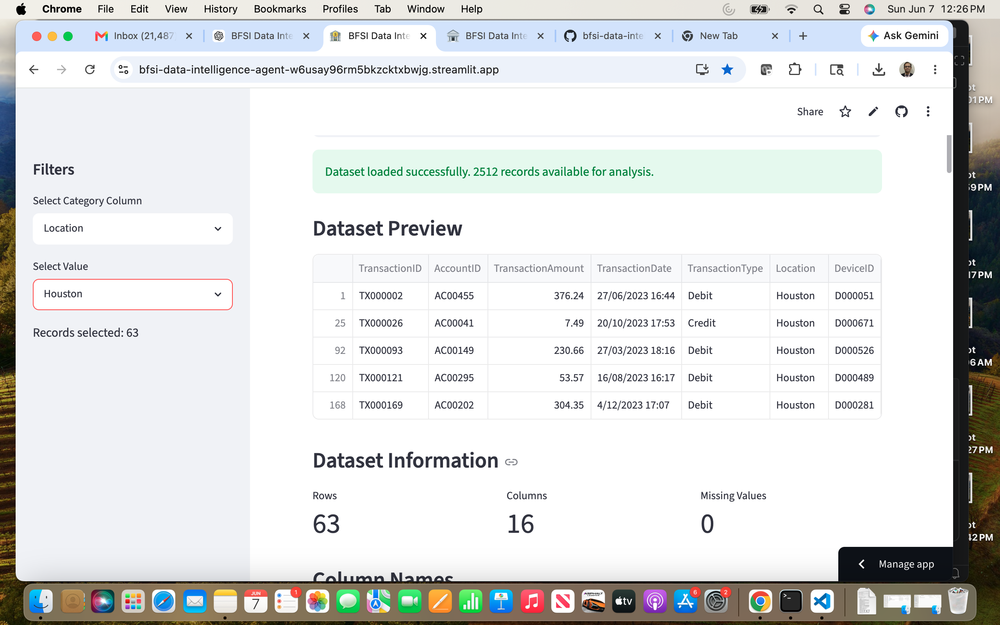
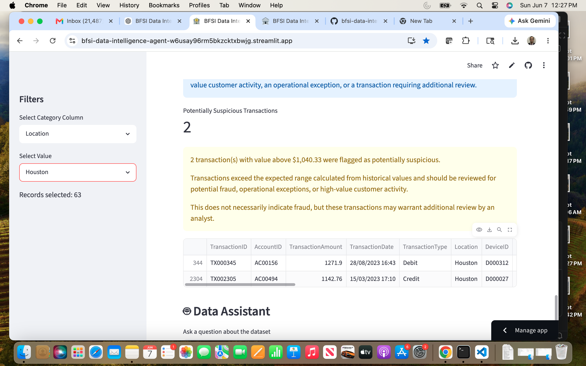
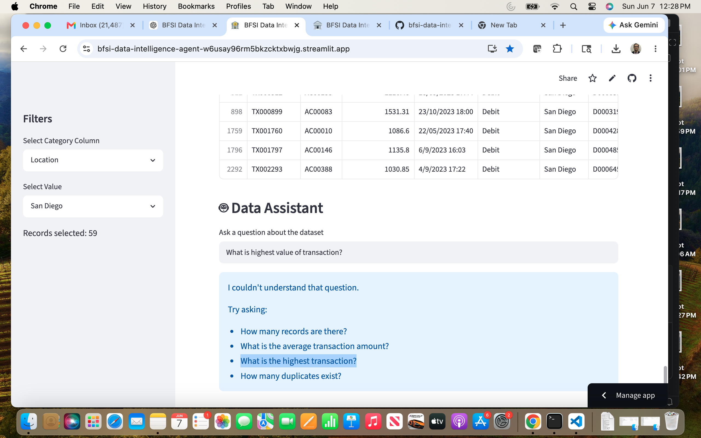
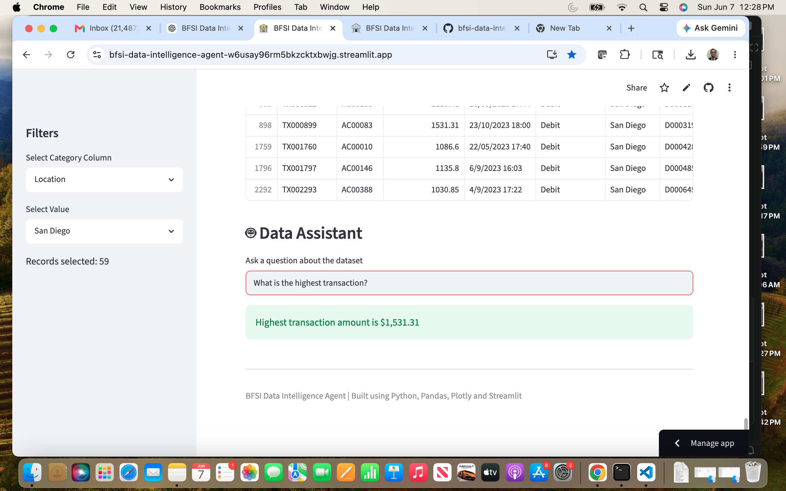

# BFSI Data Intelligence Agent

An AI-inspired analytics application built using Python, Streamlit, Pandas, and Plotly.

## Live Application

🔗 Streamlit Application: https://bfsi-data-intelligence-agent-w6usay96rm5bkzcktxbwjg.streamlit.app/

🔗 GitHub Repository: https://github.com/gauravpurandare/bfsi-data-intelligence-agent

## Features

* Data Quality Analysis

  * Missing value detection
  * Duplicate record detection

* Interactive Analytics

  * KPI metrics
  * Summary statistics
  * Interactive visualizations

* Fraud Detection

  * Statistical anomaly detection
  * Suspicious transaction identification
  * Transaction explanation engine

* Data Assistant

  * Natural language queries
  * Business insights generation

## Application Screenshots

### 🏦 Application Home Page

The landing page allows users to upload banking transaction datasets and perform automated data quality checks, fraud detection, business analysis, and AI-assisted insights.

---

### 📊 Dataset Preview & KPI Dashboard

The application automatically analyzes uploaded datasets and provides key metrics including record count, column count, missing values, duplicate detection, and summary statistics.

---

### 🚨 Fraud Detection & Explainable Analytics

Transactions exceeding statistically calculated thresholds are automatically identified as potentially suspicious. The application provides business-friendly explanations to help analysts understand why a transaction was flagged.

---

### 🤖 Data Assistant – Natural Language Queries

Users can interact with the dataset using simple natural language questions without writing SQL or Python code.

Example question:

---

### ✅ Data Assistant Response

The assistant returns contextual answers derived directly from the uploaded dataset.

## Technology Stack

* Python
* Streamlit
* Pandas
* Plotly
* GitHub

## Sample Questions

* How many records are there?
* How many columns?
* What is the average transaction amount?
* What is the highest transaction?
* How many duplicates exist?

## Future Enhancements

* OpenAI-powered insights
* Advanced fraud analytics
* Streamlit Cloud deployment
* Executive summary generation

## Author

Gaurav Purandare
